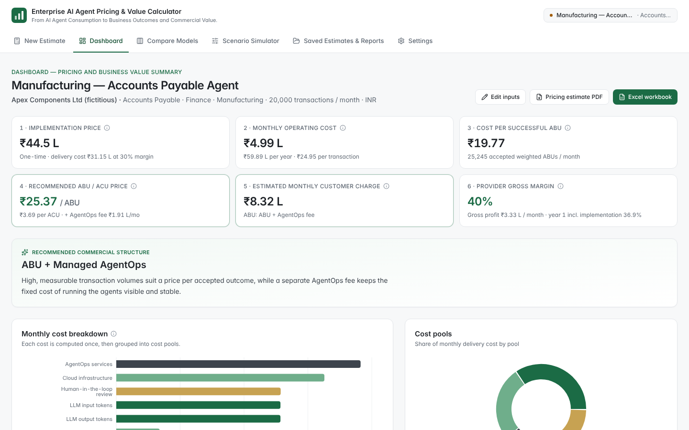
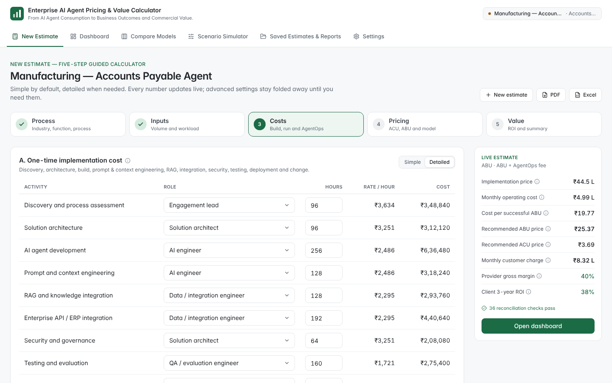
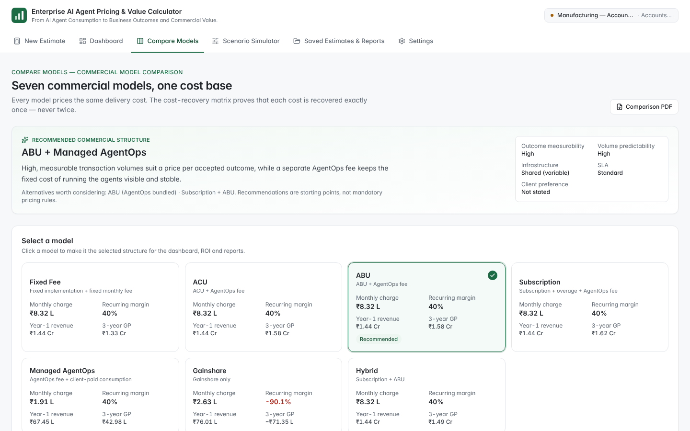
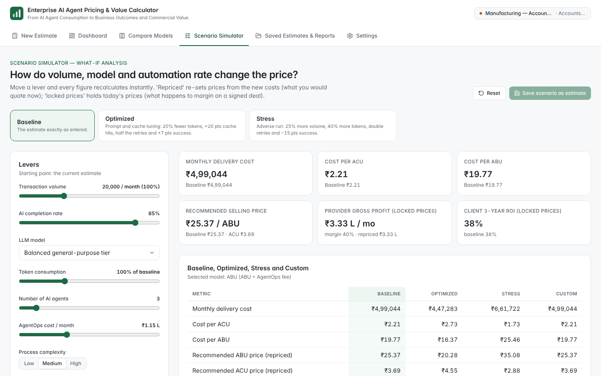
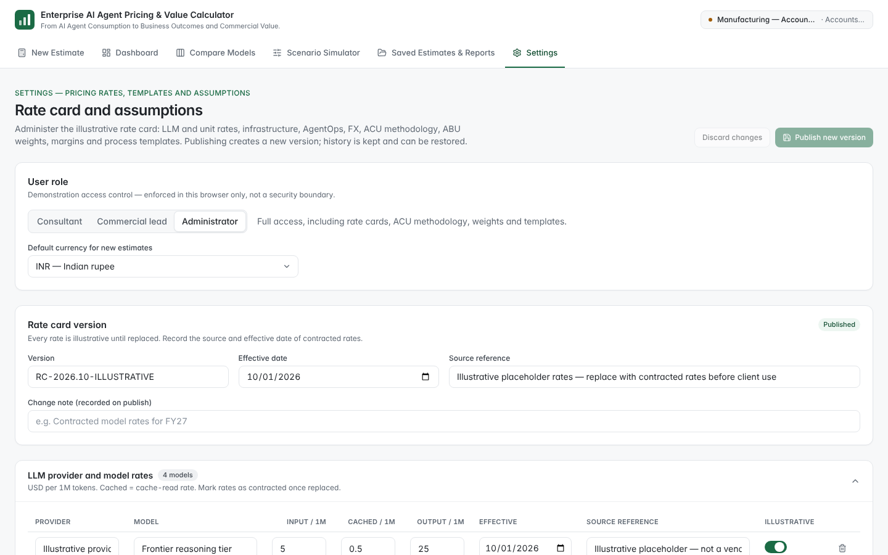

# Enterprise AI Agent Pricing & Value Calculator

**From AI Agent Consumption to Business Outcomes and Commercial Value.**

**Live app:** https://ai-cost-calculator-kappa-blond.vercel.app

A web application for enterprise AI consulting, AI Agents-as-a-Service, AI FinOps, AgentOps and AI commercialisation teams. A consultant picks an industry, function and process, enters a handful of business assumptions, and gets — in minutes — what an AI agent costs to build and run, what each successful business transaction costs, how to price it under seven commercial models, the provider's gross margin and the client's ROI. It covers business-process agents and the complete IT SDLC.



> **Illustrative data — replace before client use.** Every default rate (model token prices, OCR, cloud, AgentOps, implementation roles, FX) is a placeholder, not a vendor quote. Model tiers are deliberately generic ("Illustrative frontier tier"). Sample client names are fictitious. Replace rates with contracted or published figures — with source references and effective dates — in **Settings** before using any output with a client.

## What it answers

1. What will an AI agent cost to develop and deploy?
2. What will it cost to operate monthly and annually?
3. How much does each successful AI business transaction (ABU) cost?
4. How should the agent be priced commercially?
5. What revenue and gross margin does the provider earn?
6. What productivity and financial benefits does the client achieve?
7. Which commercial model fits the process?
8. How do volume, AI model or automation rate change the price?

## The six sections

| Section | What it does |
|---|---|
| **New Estimate** | Five-step guided calculator: process → inputs → costs → pricing → value. Ten basic inputs; tokenomics and operations stay under *Advanced settings*. A live summary updates on every keystroke. |
| **Dashboard** | Six headline cards (implementation price, monthly operating cost, cost per successful ABU, recommended ABU/ACU price, monthly customer charge, provider gross margin), cost breakdown, model comparison, annual revenue, three-year outlook, client value and the recommended structure. Every metric has a tooltip. |
| **Compare Models** | All seven commercial models side by side, three-year projection, the **cost-recovery matrix** (proof that no cost is recovered twice) and the full commercial-terms editor. |
| **Scenario Simulator** | Sliders for volume, completion rate, model, tokens, agents, AgentOps, complexity, margin and subscription price. Baseline / Optimized / Stress presets. Shows *repriced* results (what you would quote now) and *locked-price* results (what happens to margin on a signed deal). |
| **Saved Estimates & Reports** | Project library (auto-saved in the browser), 12 sample projects, JSON import/export, audit trail, five PDF reports and the editable Excel workbook. |
| **Settings** | Version-controlled rate card: LLM provider/model rates with effective dates and sources, OCR, orchestration, infrastructure, AgentOps, FX and delivery-cost index, ACU methodology and weights, ABU weights, margins, and editable process templates. Role-based edit access (demo). |

## Screenshots

| Five-step calculator — costs | Compare models |
|---|---|
|  |  |
| **Scenario simulator** | **Settings — rate card** |
|  |  |

## Process library

- **17 industries**, **12 business functions**, **89 process templates** (cross-industry and industry-specific: Banking KYC, Insurance Claims, Healthcare documents, Logistics freight invoices, …) plus custom processes.
- **IT SDLC**: all 19 stage agents (Requirements Analysis → Change Impact Analysis), each with its own ABU (e.g. *accepted development task*, *verified resolved defect*, *successful deployment*), and 7 preconfigured multi-agent templates (AI Coding Assistant, Requirements-to-Code, Automated Testing, Code Review, Legacy Modernization, DevOps & Deployment, End-to-End Agentic SDLC). A workflow composer sums stage profiles into a multi-agent workflow. SDLC volume can be derived from engineering drivers (teams × sprints × stories, PRs, reviews, builds, deployments…). Lines of code, suggestions and story points are never billable ABUs.

## How the numbers work

All calculations run in one deterministic engine (`src/engine`) using `decimal.js` at 34 significant digits — no LLM arithmetic, no binary floating-point drift. The UI, simulator, PDFs and Excel export all read the same results.

| Concept | Formula |
|---|---|
| Volume funnel | Unique = submitted × (1 − duplicates) · Executions = submitted × (1 + retries) · Accepted = unique × success rate |
| LLM cost | uncached input × input rate + cached input × cached rate + output × output rate (cached tokens billed once) |
| Total monthly cost | AI consumption + infrastructure & platform + AgentOps + human review & other |
| ACU — Method A | eligible AI consumption cost ÷ reference cost per ACU (default ₹1 = 1 ACU) |
| ACU — Method B | Σ measured resource quantity × configured ACU factor (one token ≠ one ACU) |
| Weighted ABUs | accepted unique transactions × complexity weight (Low 1.0 · Medium 1.5 · High 3.0) |
| Cost per ABU | total attributable delivery cost ÷ accepted weighted ABUs (failures and retries allocated to accepted outcomes) |
| Price | cost ÷ (1 − target gross margin), margin capped at 95% |
| ROI | (financial benefits − total AI investment) ÷ total AI investment × 100 |

**Duplicate-recovery prevention.** Every cost belongs to one of four pools (AI consumption, platform, AgentOps, human review & other). Each commercial model assigns every pool to exactly one revenue component — or to the client as pass-through, or at risk under gainshare. If AgentOps is billed as a separate fee, it is excluded from ABU/ACU prices. The engine checks this on every calculation.

**Productivity ≠ cash.** Hours saved and capacity value are reported separately. Only the cash-realised share, cost avoidance and attributable revenue margin count as financial benefits, each marked *assumption* or *validated actual*. ROI is shown both with and without assumed benefits. SDLC improvements are only projected where a measured or assumed baseline exists.

See the in-app **Methodology & formulas** page for the full method.

## Seven commercial models

Fixed Fee · ACU · ABU · Subscription (per agent, user, developer or team, with included ABUs and overage) · Managed AgentOps · Gainshare · Hybrid (subscription + ACU/ABU + AgentOps + optional gainshare). Each shows implementation revenue, MRR, annual revenue, delivery cost, gross profit and margin, cost per agent / ABU / ACU, a three-year projection and TCV. Commercial terms support minimum monthly commitments, included allowances, overage, graduated volume discounts, contract duration, annual escalation and customer-specific prices. A rules-based engine recommends a structure (e.g. *ABU + Managed AgentOps* for Accounts Payable, *Developer subscription + ACU* for an AI coding assistant) and explains why in two or three sentences, weighing outcome measurability, volume predictability, hosting, SLA and client preference.

## Reports and exports

| Export | Contents |
|---|---|
| Pricing Estimate (PDF) | Headline figures, recommendation, assumptions, costs, unit prices, model comparison, ROI, projection, validation |
| ACU / ABU Cost Breakdown (PDF) | Every cost line with driver and rate, AgentOps, ACU components, volume funnel |
| Commercial Model Comparison (PDF) | Seven models side by side and the cost-recovery matrix |
| Client ROI Report (PDF) | Productivity, benefits by status, ROI, payback, SDLC metrics |
| Three-Year Financial Projection (PDF) | Revenue, cost, gross profit and margin by year for every model |
| Editable Excel Pricing Workbook (XLSX) | Named, editable input cells and **live formulas** for costs, ACU/ABU, price book, all seven models, projection and ROI — plus a **Reconciliation** sheet comparing each formula with the calculator value |

Reports label **assumptions**, **estimates** and **validated actuals** separately.

## Getting started

Requires Node.js 20.9+ (22 recommended).

```bash
npm install
npm run dev        # http://localhost:3000
npm test           # engine, Excel and PDF tests
npm run build      # static site in ./out
npm run build:single   # one self-contained HTML file in ./dist-single (no server needed)
```

`npm run build:single` packages the whole calculator into `dist-single/index.html`, which opens directly in a browser (double-click it) and can be shared as a single file. `dist-single/artifact.html` is the same page without the outer HTML skeleton, for hosts that add their own.

The app is a fully static Next.js export: everything runs in the browser and estimates are stored in `localStorage`. Deploy `out/` to any static host — Vercel (zero config), Netlify, S3/CloudFront, Azure Static Web Apps, or GitHub Pages (set `basePath` in `next.config.mjs` for a project page). Use **Export all (JSON)** to back up or share estimates.

## Testing and financial accuracy

`npm test` runs 44 tests, including:

- input / cached / output token pricing, OCR once-per-document, retries and failed executions
- ACU normalisation (both methods) and weighted ABUs with complexity mixes
- failed-transaction allocation and duplicate prevention
- gross margin, margin cap, fixed vs recurring cost separation
- AgentOps double-count prevention and single recovery of every cost pool in every model
- graduated volume tiers, minimum commitments, subscription allowances and overage, escalation, overrides
- ROI, payback, validated vs assumed benefits, SDLC baselines
- zero-volume and zero-success edge cases; every process template and all 12 samples reconcile
- scenario consistency (baseline scenario = estimate; locked vs repriced behaviour)
- **Excel reconciliation**: each sample workbook is written without cached values, recalculated headlessly by LibreOffice, and every Reconciliation row must match the engine (skipped if LibreOffice is not installed)
- PDF generation for every report and sample, with headline figures checked against the dashboard (uses `pdftotext` when available)

## Project structure

```
src/
  engine/        deterministic calculation engine (decimal.js)
    operating.ts   volume funnel, monthly operating cost, implementation
    commercial.ts  ACU metering, price book, seven commercial models, projection
    value.ts       client value, ROI, SDLC metrics
    recommend.ts   rules-based commercial recommendation
    scenario.ts    what-if levers, presets, locked vs repriced runs
    validate.ts    input validation and warnings
    compute.ts     single entry point + reconciliation checks
  data/          industries, functions, 89 process templates, rate card, samples
  lib/export/    PDF reports (jsPDF) and formula-driven Excel workbook (ExcelJS)
  app/           Next.js pages: estimate, dashboard, compare, simulator, library, settings, methodology
artifact/        single-file build (Vite) with a small in-memory router replacing Next.js routing
scripts/         packaging helpers
  components/    UI kit, charts (Recharts), wizard steps
test/            Vitest suites
```

Stack: Next.js 16 (static export) · React 19 · TypeScript · Tailwind CSS 4 · Recharts · decimal.js · Zustand · ExcelJS · jsPDF.

## Notes and limitations

- Roles (Consultant, Commercial lead, Administrator) and the audit trail are client-side demonstrations, not a security boundary. A multi-user deployment would add an API with authentication and server-side storage.
- Costs are modelled as monthly averages; a year's volume growth is applied as a step at the start of each year.
- The ACU is a commercial abstraction defined by this calculator, not an industry standard.
- No unauthorised third-party trademarks or brand assets are used.
